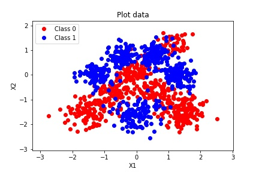
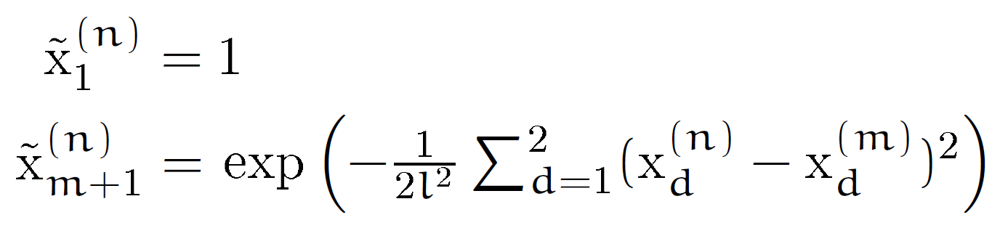

## Logistic Regression with inputs expanded by radial basis function

  

1000 datapoints, each with 2-dimensional input  and binary class output  have **non-linear class boundaries** as shown above. In order to train a classifier with such boundaries, the input of each datapoint was feature-expanded through a set of **radial basis functions** centred on the training datapoints, giving expanded input :

  

---

The value of the hyperparameter  affects how well the classifier performs. The resulting class boundaries for different  are displayed below, and their performances assessed via confusion matrices and log likelihood. It is obvious that when  becomes too small (0.01), the classifier overfits the training data.

  

  

  

  

  

---

*Demo above is part of a short coursework. Full problem statement and analysis can be found in `Problems.pdf` and `Report.pdf` respectively.*
